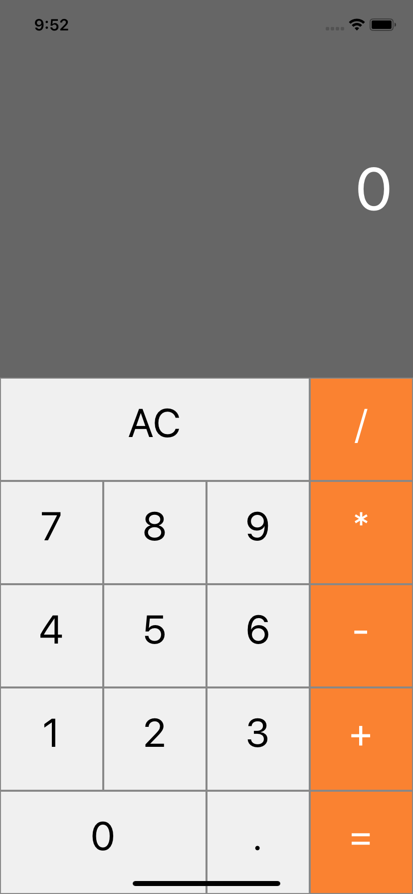
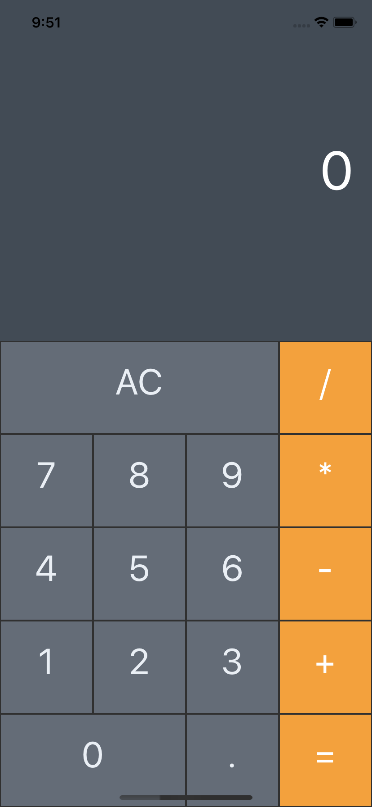

# :space_invader: Calculator in TypeScript

> Simple calculator for a quick start with TypeScript.
## :star: Features

THe project has two different color types.





## :arrow_forward: Usage

### `react-native@0.56.0` or higher

```sh
yarn install
yarn start
```

## :bookmark: License

This project is [MIT](LICENSE) licensed.
